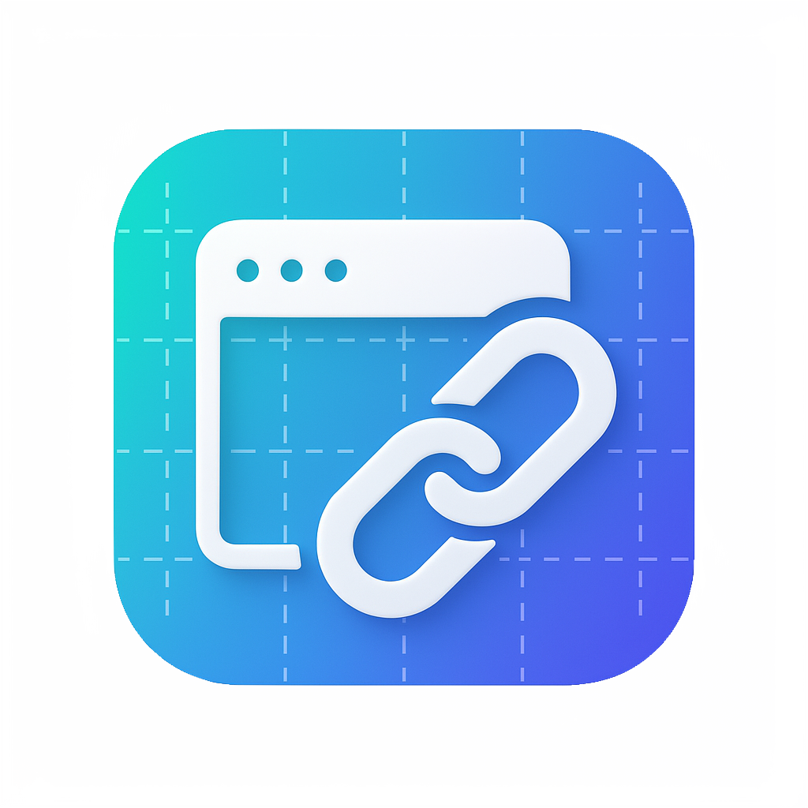

# Browser Link - Smart Browser Chooser

[](https://github.com/HenkDz/browser-link-3) <!-- Placeholder -->
[](https://opensource.org/licenses/MIT) <!-- Placeholder -->



**Browser Link intercepts every HTTP/HTTPS request from your OS, matches it against your custom rules, and opens the link in the browser you prefer.**

## Why it exists

Switching between browsers for different workflows is cumbersome. Common scenarios include:

- separating work and personal accounts;
- using browser-specific web apps or extensions;
- testing sites in multiple engines;
- isolating sessions for privacy.

Browser Link removes the manual steps. Set it once as your default browser and let the rule engine route links automatically.

## Key features

- **Automatic browser detection** on Windows, macOS, and Linux.
- **Flexible rule engine** supporting domain, prefix, substring, and regex matching.
- **Per-rule enable/disable toggles** and icons for detected browsers.
- **Fallback browser selection** when no rule matches.
- **Single-instance handling** with fast URL forwarding.
- **Electron + React UI** for managing browsers, rules, and settings.

## How it works

1. Browser Link registers itself as the system handler for `http://` and `https://`.
2. When a link is opened, the main process loads your saved rules and detects installed browsers.
3. The rule engine selects a target browser (or uses the configured fallback).
4. The target browser is launched with the original URL via the `open` package.
5. Optional notifications confirm which rule fired.

## Screenshots

.png)

.png)

.png)

## Development

### Prerequisites

- [Bun](https://bun.sh/) 1.2.22 or newer (bundles a recent Node runtime).
- Optional: [Node.js](https://nodejs.org/) if you need tooling outside of Bun.

### Setup & scripts

Clone the repository:

```bash
git clone https://github.com/HenkDz/browser-link-3.git
cd browser-link-3
```

Install dependencies with Bun:

```bash
bun install
```

Start the development environment (Vite + Electron):

```bash
bun run dev
```

Create a production build of the renderer and Electron entrypoints:

```bash
bun run build
```

Generate platform installers with Electron Builder:

```bash
bun run package
```

To publish via Electron Builder, run `bun run release`.

## Installation status

Distribution packaging is in progress. In the meantime you can build from source using the commands above.

## Contributing

Contributions are welcome! Please open an issue or pull request with bug reports, feature ideas, or improvements.

## License

This project is licensed under the MIT License. See [LICENSE](LICENSE) for details.
